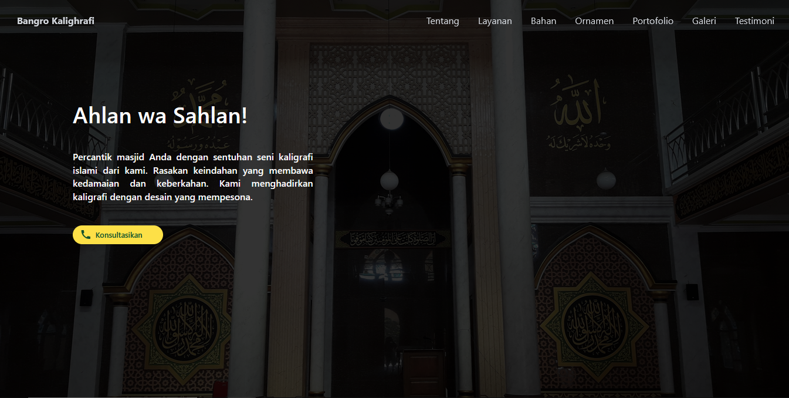
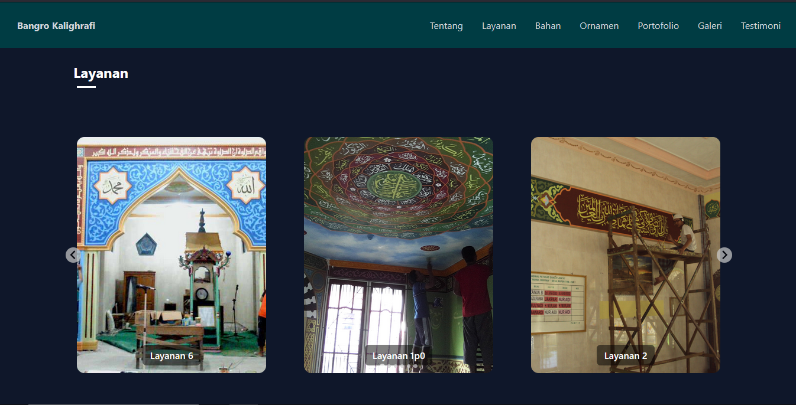
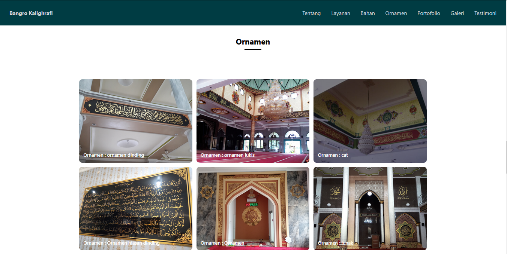
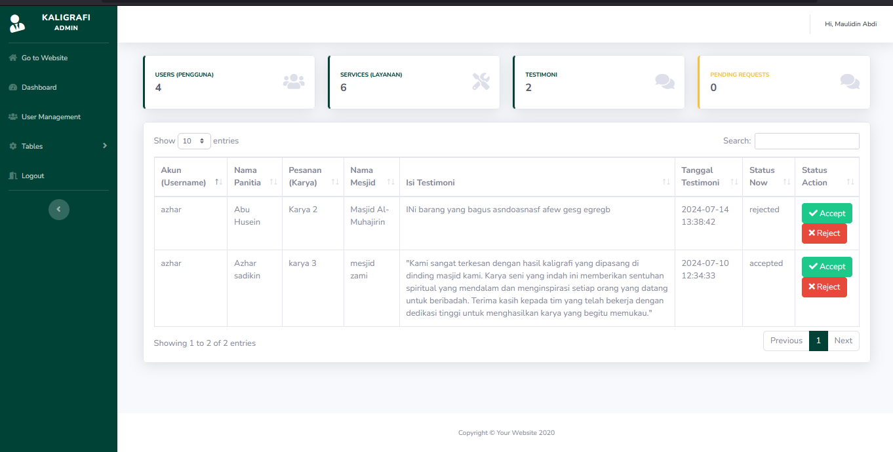

#  SI-Kaligrafi - Calligraphy Service Profile & CMS

<p align="center">
  
  
  
  
</p>

SI-Kaligrafi is a dynamic profile website and Content Management System (CMS) built for a professional calligraphy service. The application is designed to professionally showcase services, gallery, and testimonials to potential clients. All content on the public-facing homepage is fully manageable through a secure and user-friendly admin panel, demonstrating a monolithic Laravel architecture with distinct frontend frameworks for public and admin interfaces.

##  Screenshots

| Homepage | Services |
| :---: | :---: |
| **** | **** |

| Ornament | Admin  |
| :---: | :---: |
| **** | **** |

##  Key Features

This application is divided into two main parts: the public-facing homepage and the administrative panel.

#### Public-Facing Features (Homepage)
-   **Service Information:** A dedicated section to explain the calligraphy services offered.
-   **Materials & Ornaments:** Sections detailing the types of materials and ornaments available for customization.
-   **Dynamic Gallery:** Showcases the portfolio of completed calligraphy works, fetched directly from the database.
-   **Client Testimonials:** Displays positive feedback from previous clients to build trust.

#### Administrative Features (Admin Panel)
-   **Secure Login:** A dedicated authentication system for the administrator.
-   **Intuitive Dashboard:** A central hub for managing all website content.
-   **Full Content Management (CRUD):** The administrator can Create, Read, Update, and Delete all dynamic content, including:
    -   Services
    -   Materials
    -   Ornaments
    -   Gallery Items (including image uploads)
    -   Testimonials

## Tech Stack

-   **Backend**: Laravel 11, PHP 8.2+
-   **Frontend (Homepage)**: Laravel Blade, Tailwind CSS
-   **Frontend (Admin Panel)**: Laravel Blade, Bootstrap
-   **Database**: MySQL
-   **Asset Bundling**: Vite
-   **Package Managers**: Composer & NPM

## 🚀 Installation & Setup

1.  **Clone the repository:**
    ```bash
    git clone https://github.com/Huseinaby/si-kaligrafi.git
    cd si-kaligrafi
    ```
2.  **Install dependencies:**
    ```bash
    composer install
    npm install
    ```
3.  **Setup environment file:**
    ```bash
    cp .env.example .env
    ```
    Then, open `.env` and update your database credentials.

4.  **Generate application key:**
    ```bash
    php artisan key:generate
    ```
5.  **Run database migrations:**
    ```bash
    php artisan migrate
    ```
6.  **Build frontend assets:**
    ```bash
    npm run dev
    ```
7.  **Start the development server:**
    In another terminal, run:
    ```bash
    php artisan serve
    ```